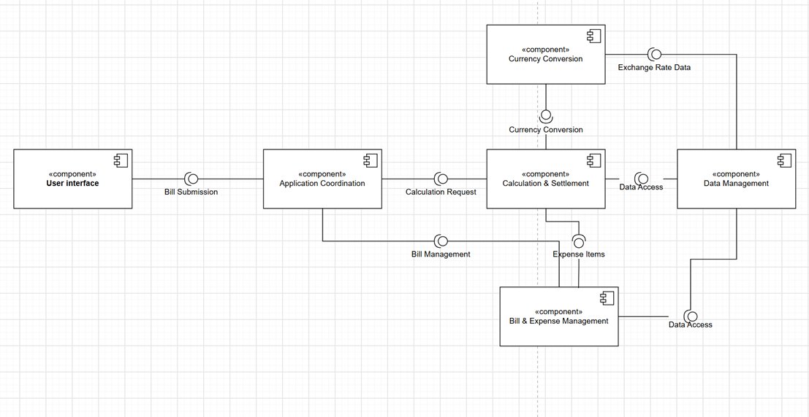
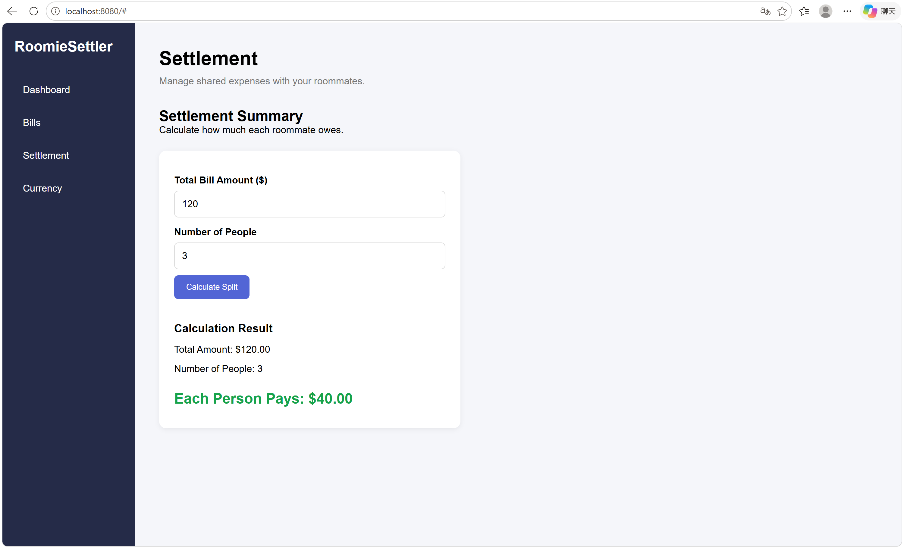

# RoomieSettler

## 1. Project Overview

RoomieSettler is a shared-expense application designed to help students, roommates, international students, and travel groups manage shared bills and expenses.

When people share bills, some expenses are divided equally among everyone, some are shared by only selected members, and others are paid individually. Calculating these expenses manually can be time-consuming and error-prone.

RoomieSettler simplifies this process by organizing bills, managing individual expense items, calculating expense shares, and helping users understand how much each person owes.

The application provides a web-based interface, a Java Spring Boot backend, and MySQL database integration. Users can create bills, add expense items, assign expenses to individual members, and calculate expense shares through the application.

## 2. Tech Stack

| Area | Technology | Current use |
| --- | --- | --- |
| Frontend | HTML, CSS, JavaScript | Browser-based interface |
| Backend | Java 17, Spring Boot 3.5.6 | Local REST API and calculation logic |
| Database | MySQL, Spring JDBC, JdbcTemplate | Database operations and data persistence |
| Build tool | Maven | Backend dependencies and project execution |
| API | HTTP / REST (JSON) | Communication between frontend and backend |
| IDE | IntelliJ IDEA | Development environment |
| Version Control | Git and GitHub | Source control and collaboration |
| Hosting | Local computer, port 8080 | Local application execution |

The technology choices support the current browser-based interface, Java backend, database operations, and local development workflow.

## 3. System Architecture

RoomieSettler follows a modular architecture organized around six logical subsystems:

1. **User Interface** — Receives user input and displays bills, expense items, and calculation results.
2. **Application Coordination** — Handles user requests and coordinates application operations through REST controllers.
3. **Bill & Expense Management** — Supports bill creation, expense item management, and expense-sharing assignments.
4. **Calculation & Settlement** — Calculates equal expense splits and individual expense totals.
5. **Currency Conversion** — Designed to support currency conversion and exchange-rate calculations in future development.
6. **Data Management** — Uses MySQL and Spring JDBC to store and retrieve bill and expense information.

### Subsystem/Component Diagram



### Deployment Diagram


**Current deployment:** The web browser and Spring Boot/Tomcat backend run locally. The browser communicates with the backend using HTTP. The backend uses MySQL for database operations. The deployment diagram shows the intended placement of all six subsystems. Some advanced functions, including live currency conversion and cloud deployment, remain planned improvements.

## 4. Repository Structure and Subsystem Mapping

```text
RoomieSettler/
├── frontend/
│   ├── index.html
│   ├── style.css
│   └── script.js
│
├── backend/
│   ├── pom.xml
│   └── src/
│       ├── main/
│       │   ├── java/
│       │   │   └── com/
│       │   │       └── financialcalculator/
│       │   │           ├── CalculatorApplication.java
│       │   │           ├── controller/
│       │   │           │   ├── BillController.java
│       │   │           │   ├── BillItemController.java
│       │   │           │   ├── CalculatorController.java
│       │   │           │   └── ExpenseShareController.java
│       │   │           ├── model/
│       │   │           │   ├── Bill.java
│       │   │           │   ├── BillItem.java
│       │   │           │   ├── ExpenseShare.java
│       │   │           │   └── SplitResponse.java
│       │   │           └── service/
│       │   │               └── CalculatorService.java
│       │   └── resources/
│       │       ├── application.properties
│       │       └── static/
│       │           ├── index.html
│       │           ├── script.js
│       │           └── style.css
│       └── test/
│
├── docs/
│   ├── subsystem-diagram.png
│   ├── deployment-diagram.png
│   └── screenshots/
│       ├── backend-running.png
│       └── frontend-integration.png
│
├── README.md
└── user-stories.md
```

| Subsystem | Current Location / Implementation | Status |
|---|---|---|
| User Interface | `frontend/` and `backend/src/main/resources/static/` | Initial UI implemented |
| Application Coordination | `backend/src/main/java/com/financialcalculator/controller/` | REST API request handling implemented |
| Bill & Expense Management | `BillController.java`, `BillItemController.java`, and `ExpenseShareController.java` | Core functionality implemented |
| Calculation & Settlement | `CalculatorService.java` and model classes | Expense calculation and splitting implemented |
| Currency Conversion | No current currency conversion service | Planned |
| Data Management | MySQL database and Spring JDBC (`JdbcTemplate`) | Database integration implemented |

The Java `controller`, `service`, and `model` packages represent the current technical implementation structure. They do not correspond to six fully independent subsystem modules.

The subsystem mapping describes the system's logical architecture and current implementation status. Additional modules or folders may be introduced as development continues.

## 5. How to Run Locally

### Prerequisites

Before running the application, make sure you have installed:
- JDK 17
- IntelliJ IDEA.
- MySQL Server and MySQL Workbench
- Maven (or IntelliJ IDEA's built-in Maven)
- Git
- A modern web browser

### Clone and start

```bash
git clone https://github.com/JudyJiang068/RoomieSettler.git
cd RoomieSettler
```

### Set Up the Database

1.Start MySQL Server.
2.Open MySQL Workbench.
3.Create the project database:
```
CREATE DATABASE roomiesettler;
```
4.If database initialization SQL scripts are provided in the project, execute them to create the required tables.

### Configure the Database Connection

Configure the database connection using environment variables.

Example application.properties configuration:

```
spring.datasource.url=${DB_URL}
spring.datasource.username=${DB_USERNAME}
spring.datasource.password=${DB_PASSWORD}
```

Set the following environment variables in your IntelliJ IDEA run configuration:

```
DB_URL=jdbc:mysql://localhost:3306/roomiesettler
DB_USERNAME=your_mysql_username
DB_PASSWORD=your_mysql_password
```

Important: Replace the example values with your own MySQL credentials. Never commit actual passwords or other sensitive information to GitHub.

### Run the Application

1. Open the project in IntelliJ IDEA.
2. Open the `backend` directory.
3. Locate `CalculatorApplication.java`:

   `backend/src/main/java/com/financialcalculator/CalculatorApplication.java`

4. Run `CalculatorApplication.java` as a Java application.
5. Wait for Spring Boot to finish starting.

The backend runs on port `8080` by default.

### Access the Frontend

The integrated frontend files are located in:

`backend/src/main/resources/static/`

Spring Boot automatically serves static resources from this directory.

After the backend starts, open the following address in your browser:

```text
http://localhost:8080/
```

The frontend will be available through the Spring Boot application.

### Verify the Backend API

After starting the backend, verify that the application is running by accessing the appropriate API endpoint.

For example, if the calculation endpoint is available, open:

```text
http://localhost:8080/api/calculator/split?amount=100&people=4
```

The expected result is a JSON response containing the total amount, participant count, and calculated share for each person.

The exact endpoint and response should be verified against the current backend implementation.

## 6. API Endpoints

The backend provides REST API endpoints for bill management, expense items, expense sharing, and calculations.

| Method | Endpoint | Description |
|---|---|---|
| GET | `/api/bills` | Retrieve all bills |
| POST | `/api/bills` | Create a new bill |
| GET | `/api/bills/{billId}` | Retrieve a specific bill |
| POST | `/api/bills/{billId}/items` | Add an expense item to a bill |
| GET | `/api/bills/{billId}/items` | Retrieve expense items associated with a bill |
| POST | `/api/items/{itemId}/shares` | Assign expense shares to members |
| GET | `/api/items/{itemId}/shares` | Retrieve expense shares for an item |
| GET | `/api/calculator/split` | Calculate an equal expense split |
| GET | `/api/calculator/totals` | Calculate individual expense totals for a bill |

### Example API Requests

**1. Create a Bill**

`POST /api/bills`

Request body:

```json
{
  "title": "Weekend Trip",
  "currency": "USD"
}
```

**2. Add an Expense Item**

`POST /api/bills/1/items`

Request body:

```json
{
  "itemName": "Dinner",
  "amount": 200.00
}
```

**3. Assign Expense Shares**

`POST /api/items/1/shares`

Request body:

```json
{
  "shares": [
    {
      "memberName": "Alice",
      "shareAmount": 100.00
    },
    {
      "memberName": "Bob",
      "shareAmount": 100.00
    }
  ]
}
```
ok
**4. Calculate an Equal Split**

`GET /api/calculator/split?amount=100&people=4`

**5. Calculate Individual Expense Totals**

`GET /api/calculator/totals?billId=1`

These examples demonstrate the main API operations currently supported by the backend.

## 7. Testing and Running Evidence

### Testing

The application can be tested using the following approaches:

- Manual API testing with Postman.
- Database verification using MySQL Workbench.
- Automated testing using JUnit and Spring Boot Test, if test cases are available.

Important test scenarios include:

- Creating and retrieving bills.
- Adding expense items to bills.
- Assigning expense shares to members.
- Validating that expense shares match the item amount.
- Handling invalid input.
- Handling nonexistent bill or item IDs.
- Verifying individual expense calculations.

Testing should verify both successful operations and error-handling behavior.

### Running Evidence
Initial screenshots are stored at:

- [Backend running](docs/screenshots/backend-running.png)
- [Frontend integration](docs/screenshots/frontend-integration.png)




Each team member should independently clone and run the project to verify that the setup instructions work on their computer.

## 8. Team Collaboration and Future Improvements

### Team Collaboration

RoomieSettler is developed collaboratively using Git and GitHub.

Team members contribute through:

- Backend development.
- Frontend development.
- Database design and validation.
- API testing and debugging.
- Documentation and project maintenance.

Feature branches and Pull Requests are used to organize code changes and facilitate collaboration.

### Future Improvements

Potential future enhancements include:

- Multi-currency expense conversion (USD to RMB).
- Group and participant management.
- More flexible expense-sharing rules.
- Automatic settlement suggestions.
- Cloud database integration.
- Secure user authentication and authorization.
- Deployment for remote access.

### Security and Development Notes

Do not commit passwords, API keys, or other secrets to the repository.

Use environment variables to configure database credentials. If environment variables are introduced, provide an `.env.example` file without real credentials and add local `.env` files to `.gitignore`.

